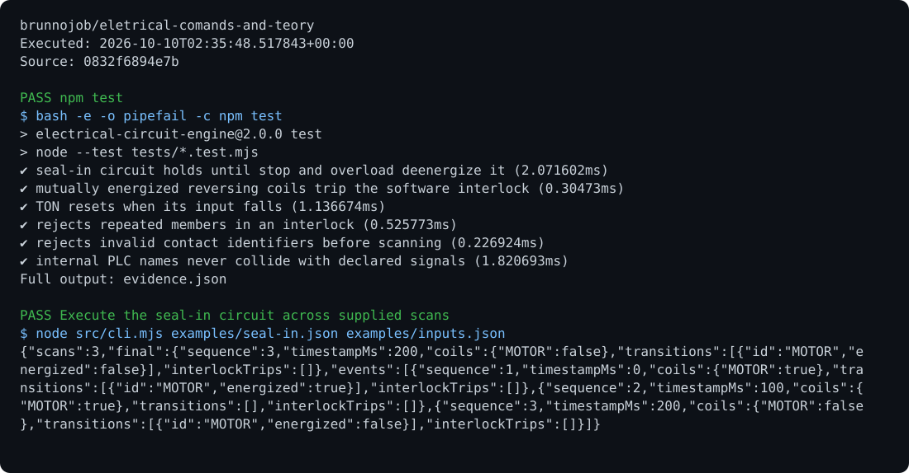

# Electrical Circuit Engine

A circuit interpreter with NO/NC contacts, AND/OR logic, TON timing, previous-state latching, and mutually exclusive coils.

## Run

Requirements: Node.js 24.

```sh
npm test
node src/cli.mjs examples/seal-in.json examples/inputs.json > result.json
```

## Behavior

Configuration bounds expression depth, tags, and coils. The clock cannot move backward. Invalid inputs do not change committed timers. Tests cover latching, delays, and interlocks.

## Optional report archive

Use the [shared operations archive client](https://github.com/brunnojob/vercel-home-telemetry-api/tree/main/cloud) to queue `result.json` under project `eletrical-comands-and-teory`. The client uses `BRUNNODEV_ACCESS_TOKEN` and retains unacknowledged reports locally.

## License

Original source and documentation are MIT licensed; see [LICENSE](LICENSE). Third-party dependencies and media retain their respective terms. Maintained by [Brunno Dev](https://brunnodev.store).

## Implementation update

The [Structured Text exporter](src/structured-text.mjs) produces IEC 61131-3 function blocks with prior-scan feedback, ordered TON calls and interlock checks before committing coils. Internal identifiers avoid signal collisions; reserved PLC identifiers and fractional delays are rejected. Run `node src/export-plc.mjs examples/seal-in.json output.st` and `node --test tests/*.test.mjs`. Validate generated code in the target PLC toolchain before hardware use.

Contribution trailer: `Co-authored-by: nyctophile <33561761+ineedfoundmyway@users.noreply.github.com>`.

## Execution proof

[](https://github.com/brunnojob/eletrical-comands-and-teory/actions/workflows/proof.yml)



[Verified run](https://github.com/brunnojob/eletrical-comands-and-teory/actions/runs/38017993729) · [Execution report](docs/proof/evidence.json)

Run `python .proof/record.py` after installing the prerequisites above. The scenarios execute repository code and verify exit codes and expected output. CI publishes `execution-proof` with the transcript, input fingerprints and source commit. The downloadable report identifies the exact tested version; the workflow badge tracks the latest run.
